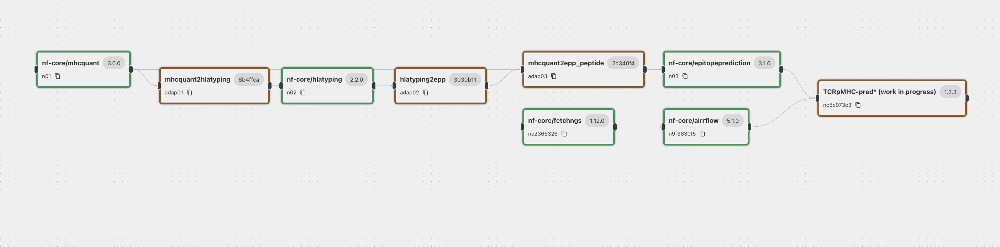

# Binding Prediction

Integrated binding prediction analysis with combined TCR sequencing, MHC typing and mass spectrometry analysis running as individual paths that feed into a TCRpMHC binding prediction node.

NOTE: The final aggregation node and the use of a real world dataset that covers the three modalities are work in progress. The config currently describes a valid meta-pipeline that does not yet run.

